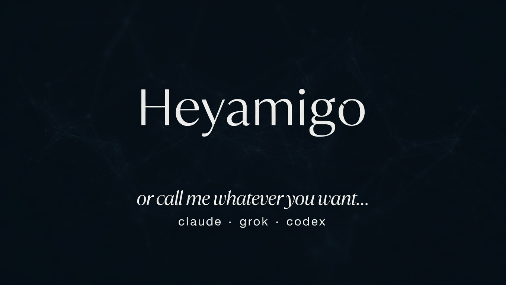

<p align="center">
  
</p>

# heyamigo

A chat-resident assistant for WhatsApp and Telegram. Claude, Codex, or Grok under the hood, durable SQLite queues, per-sender timezone scheduling, two-track architecture so browser work never blocks the chat.

```
WhatsApp / Telegram ─► inbound ─► chat workers ─► outbound ─► WhatsApp / Telegram
                                     │                ▲
                                     ├──────► async / browser ─┤
                                     └──────► memory_writes ───┘
```

## What it does

- **Long-term memory per person, per chat, per topic.** Files on disk. The agent decides what's worth keeping; background workers consolidate while you're not chatting.
- **A relevance watchlist.** Open loops the agent tracks on your behalf — questions you'd forget, things you're waiting on — surfaced naturally when the moment matches. Built like external working memory for the user.
- **Scheduling in the sender's timezone.** Natural language → `[REMIND: 2026-05-26 09:00 — ...]` or `[CRON: 0 9 * * 1 PROMPT — ...]`. Fires at the user's wall-clock 9am, not the server's. Cron variants: deliver text, run AI, kick off async work, or drive a browser.
- **A real Chrome.** Browser delegation via `[ASYNC-BROWSER: ...]` to a parallel provider session on a shared logged-in Chrome over CDP. TikTok, Instagram, anywhere the owner is logged in. SSH-tunneled noVNC for setup.
- **Per-reply footer with model, thinking, and confirmation tags.** Every side effect from the turn is visible: `_9.9s · gpt-5.6-sol · xhigh · fresh · +remind · +thread-new · +digest_`. No guessing whether a schedule actually got created.
- **Default-deny chat activation.** Groups and DMs only answer when their own `triggerMode` is set in `config/access.json`; missing means `off`. Per-role token quotas, file-size caps, tool restrictions.

For the why behind these — claim primitives, tag-as-side-effect channel, per-category learning, provider abstraction, the trade-offs that didn't survive the first revision — see [`docs/architecture.md`](docs/architecture.md).

## Quick start

```bash
npm install -g @anthropic-ai/claude-code
npm install -g @c4t4/heyamigo
claude                                  # log in once, then exit

heyamigo setup                          # wizard: pair WhatsApp, pick personality
heyamigo start                          # background, auto-restart
heyamigo logs                           # tail
```

Telegram is optional. Create a bot with BotFather, set `telegram.enabled: true` and `telegram.botToken` in `config/config.json`, then allow users/groups in `config/access.json`. Telegram user keys use `tg_<user_id>`; Telegram group entries use addresses like `tg:group:-1001234567890`.

Other providers:

- Codex: install `@openai/codex` and set `ai.provider: "codex"` in `config/config.json`.
- Grok Build: install with `curl -fsSL https://x.ai/cli/install.sh | bash`, run `grok login`, and set `ai.provider: "grok"`. Chat and non-browser async work are supported; browser jobs fail closed because Grok does not currently expose invocation-scoped MCP isolation.

Browser jobs use `browser.cdpUrl` (default `http://127.0.0.1:9222`). Claude and Codex receive an invocation-scoped Playwright MCP pointing only at that endpoint; ambient Chrome integrations and stale global Playwright entries are not available to the browser worker. A shared SQLite lease registry identifies tabs by stable CDP target ID and filters each MCP to only the tabs owned by its task. Up to `browser.maxWorkers` tasks (default 3) can therefore drive separate background tabs in parallel without mutable global tab indexes. A task can own several tabs, automatically adopts popups opened by an owned tab, and can explicitly claim an existing user tab by stable ID; claimed user tabs stay open, while task-created tabs are cleaned up. Before work is claimed, heyamigo also opens the browser-level CDP WebSocket and runs `Browser.getVersion`. If that check fails, the job stays pending instead of falling back to another browser.

Chrome has its own lifecycle, separate from the bot. Every automatic path uses the single authenticated VNC profile at `~/.config/google-chrome-novnc`; the profile is not configurable, so setup and runtime cannot silently create or select another one. Use `heyamigo chrome status|start|stop|restart`. `heyamigo chrome restart` also recovers the Xvfb, x11vnc, and noVNC stack using the same hardened launcher as setup; it reports missing packages instead of installing them and prints the exact profile it loaded. noVNC binds directly to port 6090 by default, or automatically uses backend port 6080 when an nginx frontend already owns 6090. Generated viewer links enable local scaling by default with `resize=scale`. The command matches both CDP port and profile path before operating and refuses to touch an unknown browser. `heyamigo restart` continues to restart only the Node bot.

## In-chat commands

| Command | What it does |
|---|---|
| `/reset` | Fresh AI session for this chat |
| `/status` | Session info, context utilization |
| `/thinking [level]` | Show or set this chat's Codex reasoning level; `default` clears the override |
| `/queues` | Live queue depths |
| `/crons` · `/reminders` | List recurring schedules + one-shots (token cost included) |
| `/threads` | List the relevance watchlist; resolve / drop / pause / weight |
| `/digest` | Force a memory consolidation now |

## Roles

`config/access.json`. Three default roles, easily extended.

| Role | Memory | Tools | Notes |
|---|---|---|---|
| admin | everything | all | unrestricted |
| user | own profile | none | can't see other users or internals |
| guest | none | none | prompt-injection resistant |

## Personalities

`config/personalities/*.md` — system-prompt fragments that define the bot's voice. The default (`sharp.md`) is opinionated about not people-pleasing. Swap or write your own.

## Where to run it

A VPS (Hetzner, DO) at ~$5/mo is the path of least resistance. Home server or Raspberry Pi also fine. Needs Node 18+, a persistent filesystem, and outbound access to the enabled chat channels. Not serverless-compatible.

## Tracking memory with git

The bot writes markdown files under `storage/memory/` as it learns. `git init` in your project root and commit periodically gives you a readable diff of what the assistant has come to believe about people and topics. Skip `storage/auth/` (WhatsApp keys) and `storage/logs/`.

## License

MIT. Built by [Catalin Waack](https://github.com/C4T4) · [LinkedIn](https://www.linkedin.com/in/catalinwaack/).
